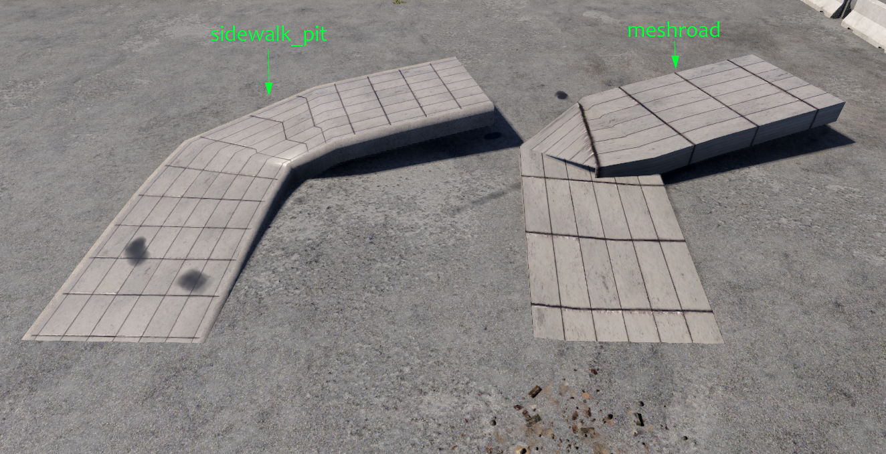
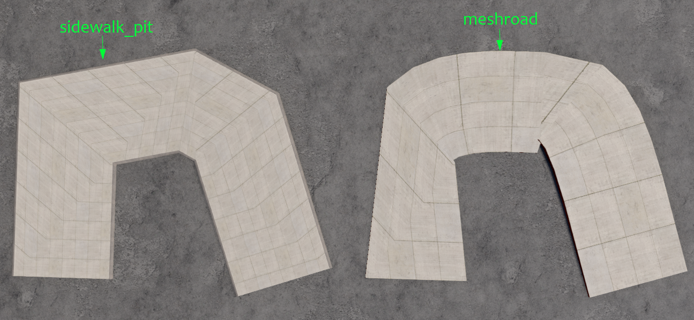
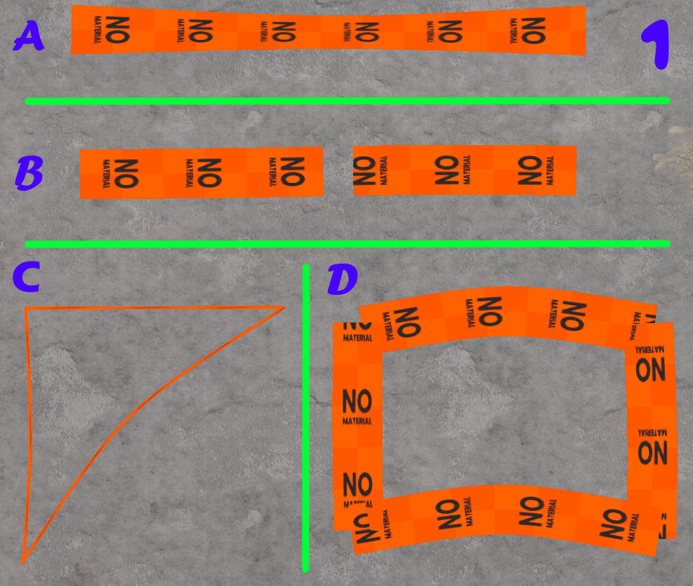
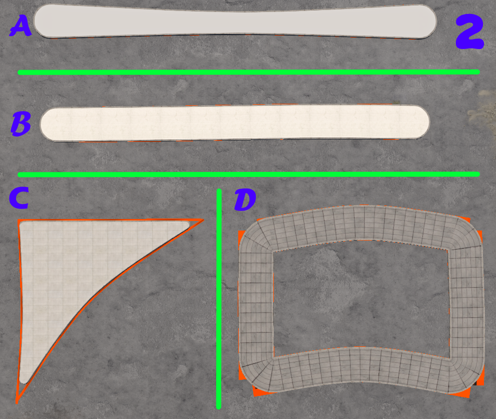
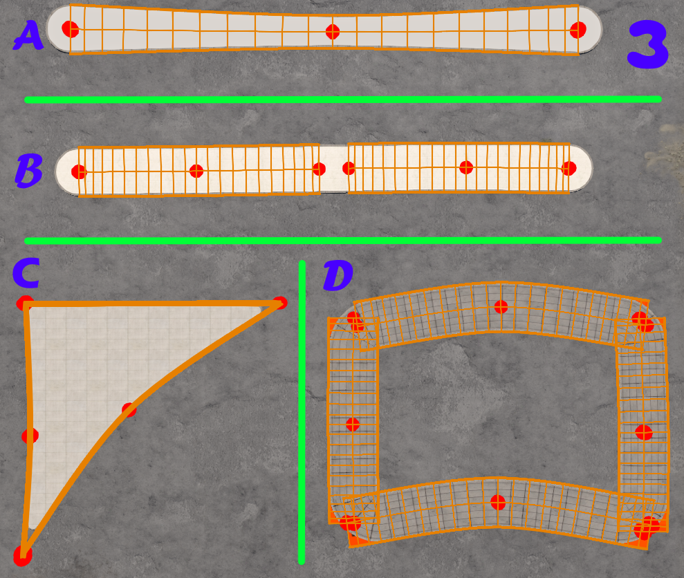
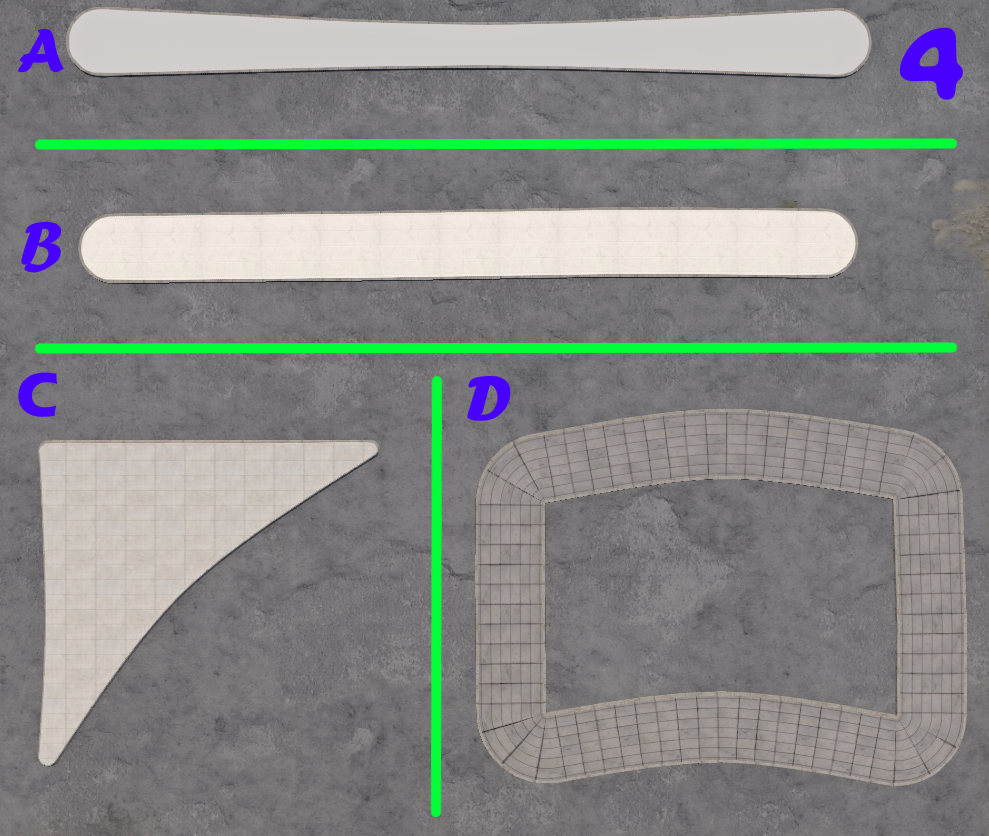
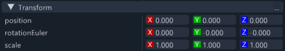

# Sidewalk PIT

**Sidewalks, bridges and traffic islands for BeamNG.drive maps — quickly and easily.**

Mark them out in the World Editor, run one script, and everything else builds itself — no Blender or coding knowledge needed.

The script reads your map files directly and, in a single run, builds the sidewalks with rounded junctions and capped ends — a finish that's hard to achieve by hand.

[](https://youtu.be/o2l4EGroNT4)

*Click the image to watch the demo.*

---

## Contents

**Part A — the basics.** Everything you need to build sidewalks from the World Editor.

1. [How it works](#1-how-it-works)
2. [Installation](#2-installation)
3. [Quick start](#3-quick-start)
4. [What to draw](#4-what-to-draw)
5. [The editor tool and the tags](#5-the-editor-tool-and-the-tags)
6. [Getting the result into the game](#6-getting-the-result-into-the-game)
7. [Troubleshooting and limitations](#7-troubleshooting-and-limitations)

**Part B — advanced.** Not needed for normal use.

8. [Running from the command line](#8-running-from-the-command-line)
9. [The styles file](#9-the-styles-file)
10. [Settings in the script](#10-settings-in-the-script)

---

## 1. How it works

**Draw objects in the World Editor → run one script in Blender → get sidewalks.**

The objects don't have to be precise. You mark where the sidewalk runs and how wide it is, and the mod handles the rest: ground conforming, rounded corners, joins between segments, materials, and a sound collision mesh.

> **You don't need to know Blender.** Your entire interaction with it: open it, load the script, change one line, press ▶, close it.

**Who this is for:**

- **Vanilla map editors with no Blender knowledge** — sidewalks, bridges and traffic islands get built straight from the World Editor
- **Map builders who do work in Blender** — instead of measuring positions, modelling by hand and rounding corners one at a time, you get all of it from objects you've already drawn

**The same MeshRoad, two results.** On the right, the MeshRoad itself; on the left, what the mod built from it automatically:





---

## 2. Installation

Download the latest release from **Releases** (e.g. `sidewalk_pit_1.0.0.zip`) and extract it. Inside are two files, each with its own destination:

| File | What it is |
|---|---|
| `sidewalk_pit_mod.zip` | The tool that runs inside the game, including the preview and the language files |
| `sidewalk_pit.py` | The script that builds the geometry in Blender |

### `sidewalk_pit_mod.zip` — the in-game tool

**Option 1 — as a mod (recommended).** Copy the zip **as-is, without extracting it**, into:

```
%LOCALAPPDATA%\BeamNG\BeamNG.drive\current\mods\
```

**Option 2 — as loose files.** Extract the zip and copy **both** Lua files — `sidewalkTags.lua` and `sidewalkPreview.lua` — into:

```
%LOCALAPPDATA%\BeamNG\BeamNG.drive\current\lua\ge\extensions\editor\
```

> With option 2 the `editor` folder doesn't exist yet — you have to create it, along with any missing folders above it. Note that both files are required: `sidewalkTags.lua` loads `sidewalkPreview.lua`, and without it the tool won't load at all. The language folders in the zip aren't copied this way, so the UI stays in English.

Start the game. The tool appears in the World Editor under **Window → PIT → Sidewalk Tags**.

### `sidewalk_pit.py` — the Blender script

You need **Blender** installed, with Collada (`.dae`) export support — present in the official builds. There's no `pip install`, no external libraries and no add-ons to install: the script imports only `bpy`, `bmesh` and `mathutils`, plus modules from the Python standard library.

The script itself isn't installed anywhere — it's not an add-on and not part of the game. Save the file wherever is convenient, and run it only at the end of the process, after you've drawn and saved the map.

*Tested on BeamNG.drive 0.39 and Blender 4.5. Other versions haven't been tested.*

---

## 3. Quick start

1. Open your map and press **F11** to enter the World Editor
2. Go to **Window → PIT → Sidewalk Tags**
3. Click **create config** — a settings file is created for the map
4. Open **advanced**, pick a paving material, give it a display name, and click **add to config**

   > **Tip:** tick **likely candidates** to narrow the list down to materials that look like paving, kerb or wall by name.

5. Repeat step 4 for the kerb material — this time tick **curb edge** and also **also set as the map's curb material**
6. Draw a **DecalRoad** along the sidewalk you want
7. Select what you drew, click **mark as sidewalk**, then the style button you want. **render selection** will show you the result right away
8. **Save the map** — mandatory, otherwise Blender sees nothing
9. In Blender: **Scripting** tab → **Open** → pick `sidewalk_pit.py`, update `LEVEL_NAME` at the top of the file, and press **Run Script** (▶)
10. Restart the game, then in the **Asset Browser** go to `art/shapes/sidewalk` and add `sidewalk_pit.dae`

Steps 6–9 repeat on every work cycle. Steps 1–5 and 10 are one-time per map.

---

## 4. What to draw

**The mod builds only from what you marked with the `WarningMaterial`** — the orange one with NO MATERIAL written on it. On a MeshRoad, leaving the materials empty counts the same. Any object with a real material is skipped on purpose, so existing roads on the map don't turn into sidewalks.

The quick way to mark them: select the objects and click **mark as sidewalk** in the tool window, and the material is written to all of them at once.

> **If you're picking `WarningMaterial` by hand and it isn't in the material list:** create any new road on the map. You can delete it immediately; next time you open the list it'll be there. Known game bug.

### Sidewalk → DecalRoad

The sidewalk is built at the **exact width of the DecalRoad**, following the width of each node individually.

- **Height is handled automatically.** Height is sampled from the terrain and the sidewalk sits at a fixed distance above it (10 cm) along its whole length. The path is densified to roughly one point every 0.75 m before sampling, so the sidewalk follows the ground even over rolling terrain. You don't need to touch height at all
- The exception: a DecalRoad with **only two nodes** isn't densified and stays a straight segment. Add a middle node
- Two sidewalks whose ends are close together (up to 2.5 m) merge into a single object with a rounded corner — you don't draw the turn
- A **real junction** (three ends or more) is deliberately not merged, and a DecalRoad shorter than 3 m doesn't take part in merging. If a corner isn't rounding, that's usually why
- Open ends get rounded caps, but only below 5 m wide. The check runs per end



*Step 1 — this is all you draw.* **A:** one DecalRoad whose width varies between nodes. **B:** two separate DecalRoads close together with a gap between them. **C:** thin DecalRoads in a closed loop. **D:** four wide DecalRoads forming a rectangle.



*Step 2 — what the mod built.* **A** got exact per-node width and rounded caps. **B** merged into one continuous strip. **C** became a filled polygon. **D** got four connected corners without you drawing a single turn.

> **C versus D explain the 0.5 m rule:** the exact same closed shape — thin DecalRoads give a filled island, wide DecalRoads give a sidewalk that surrounds a gap.

### Traffic island → thin DecalRoads in a closed loop

Draw the island's **outline** with DecalRoads under 0.5 m wide. When the loop closes, a filled polygon is built with a kerb around it and rounded corners. It doesn't have to be a single DecalRoad; several meeting segments work too.

The kerb angle on islands is steeper (34.6°) than on a sidewalk — the `pit_profile` tag controls this.

### Bridge or sidewalk over an object → MeshRoad

- **The path is smoothed through turns and slopes** — this is the main reason to choose MeshRoad. A corner too tight to round is kept as a sharp, accurate corner rather than deforming
- **Convenient for a sidewalk over an object** — in the MeshRoad tool settings you can set nodes to always sit a fixed distance above the surface beneath them
- **Width** per node, **wall height** from the node depths
- The geometry stays at the height you drew and doesn't conform to the terrain
- Can you see the bridge from below? Tag `pit_bottom = on`. Bridge with a lateral slope? `pit_roll = on`

The MeshRoad you draw serves as the blueprint, and the object built from it replaces it in practice — it stays hidden on the map as the source you edit.

### When you're done editing: hide — don't delete

The objects you drew stay on the map, and if they're visible they'll poke out of and under the sidewalk.

> **Don't delete them.** They're the source the script builds from — deleting means the sidewalk disappears on the next run. **Hide only.**

Clicking **select decals** (or **select MeshRoad**) selects all of them at once; hiding one of the selected objects hides the whole selection, and the same works in reverse. Timing doesn't matter — the script reads the map files, not what's shown on screen.





*Compare with step 2: there the orange edges poke out from under and around the sidewalk.*

---

## 5. The editor tool and the tags

The tool does two things: it manages the map's materials and styles, and it lets you tag objects.

**Tagging isn't mandatory** — an untagged object gets a random style according to the weights in the config.

| Axis | Field | Applies to | Values |
|---|---|---|---|
| curb edge | `pit_curb` | everything | style names |
| walk centre | `pit_walk` | everything | style names |
| curb profile | `pit_profile` | everything | `walk` / `island` |
| MeshRoad material | `pit_wall` | MeshRoad | style names |
| bottom faces | `pit_bottom` | MeshRoad | `on` / `off` |
| banking from nodes | `pit_roll` | MeshRoad | `on` / `off` |

### Preview inside the editor

You don't have to run the script to see what you'll get. Select some objects and click **render selection** — the sidewalk is drawn in the editor exactly as it will be built, rounded corners, caps and materials included.

- **The preview isn't saved with the map.** It only exists in the current session, and **clear preview** removes it
- **auto refresh** re-renders as you drag nodes. There's a **delay (s)** field to control the rate, and it switches itself off above 12 roads so the editor stays responsive
- It doesn't replace running the script — the preview is editor-only drawing, and the file that goes into your map is still produced in Blender

> **In rare edge cases the preview will look slightly different from the final result.** Two separate implementations compute the same geometry, one in Lua and one in Python, and they're calibrated against each other — but at unusual junctions or extreme turns a small difference is possible. The script's output is always the authoritative one.

### Marking the material in one click

Instead of hunting for `WarningMaterial` in the material list: select the objects and click **mark as sidewalk**. The button writes the material to every DecalRoad and MeshRoad in the selection and skips anything already marked. It goes through the editor's undo history, so Ctrl+Z reverses it.

### Interface languages

The tool is translated into 13 languages and follows the game's language: German, English, Spanish (Latin America and Spain), French, Japanese, Korean, Polish, Portuguese (Brazil and Portugal), Russian, and Chinese (Simplified and Traditional).

> **The translations are machine-translated and haven't been checked by native speakers.** Expect inaccuracies, especially in technical terms. If you spot a bad string in your language, open an Issue — a one-string fix is very welcome.

### Main buttons

| Button | What it does |
|---|---|
| **create config** | Creates a settings file for the map (only shows when there isn't one) |
| **reload config** | Reloads from disk, after a manual edit |
| **the colour buttons** | Write the tag to everything selected; **clear X** clears it |
| **select decals** / **select MeshRoad** | Select every relevant object on the map |
| **mark as sidewalk** | Writes `WarningMaterial` to everything selected |
| **render selection** / **clear preview** | Shows and clears the preview |
| **scan now** | Scans and shows how many are tagged and with what. A tag in **red** = a value that doesn't exist in the config |

### advanced — adding materials

| Element | What it does |
|---|---|
| **likely candidates** | Narrows to materials that look like paving, kerb or wall by name |
| **solid materials only** | Hides transparent and emissive materials |
| **U / V** | Scale, in metres per tile |
| **walk centre / curb edge / MeshRoad wall** | Which axis the style is added to |
| **band** | Atlas band — only appears if the kerb material is an atlas |
| **add as a new style** | Adds another style instead of updating the existing one |
| **also set as the map's curb material** | Sets the kerb for the **whole** map |
| **remove** | Deletes a style. Objects already tagged with it don't change and will show red in scan |

---

## 6. Getting the result into the game

The export always goes to the same place inside the map and is overwritten on every run:

```
art/shapes/sidewalk/sidewalk_pit.dae
```

**Once per map only:**

> **After the first run you have to restart the game.** The `.dae` is created while the game is already running, so it won't show up in the Asset Browser until you restart. This is only needed the first time — later runs just update the existing file.

1. Restart the game, open the **Asset Browser** and go to `art/shapes/sidewalk`
2. Add `sidewalk_pit.dae` to the map
3. **Fix the Transform** — the object lands at a random position. Select it and, in the **Inspector**, zero the values in the **Transform** section exactly like this:

   

4. Save the map

> **Step 3 is the critical one.** The geometry is built in world coordinates — every sidewalk already sits in the right place inside the file. Any move, rotation or scale shifts them all together and takes them out of position.

From then on, every re-run of the script updates the sidewalks in place, without reloading the map.

---

## 7. Troubleshooting and limitations

| Message / symptom | Cause and fix |
|---|---|
| `Could not locate a BeamNG.drive installation` | Set it manually: `GAME_ROOT = r"C:\...\BeamNG.drive"` — the folder that contains `levels` |
| `No items.level.json found under ...` | The script reads the map files straight off disk, so the map has to be an open folder and not a sealed `.zip`. If it is open, the script may have locked onto the wrong folder; set `GAME_ROOT` manually |
| `Found 0 roads to process` | You didn't draw anything, or you forgot to **save the map** |
| `curb.material is missing` | Add a material with **also set as the map's curb material** |
| `skipped N MeshRoad that have a texture assigned` | Those MeshRoads got a real material. Remove it |
| `tags not present in the config` | You tagged with a value that doesn't exist. **scan now** will show them in red |
| The console prints `crosswalk DecalRoad` | Legacy name in the code — it means every DecalRoad you marked |
| Tyres blow out on contact with the sidewalk | Check `FORCE_FACE_ORIENTATION = True` and re-run. Check the `collision` lines in the report |
| The sidewalk or island is buried in the ground | Those DecalRoads have `overObjects` ticked, so they don't conform to the ground. **Untick it** |
| Faces are missing underneath | Normal — the underside is discarded. For a bridge seen from below, tag `pit_bottom = on` |
| `[corner] warning: ... the swept centreline still turns tighter than its own half-width` | A MeshRoad turn too tight to build — the inner edge folds there. Widen the corner, add a node, or narrow the road in the editor. The output includes the exact coordinates |
| `invariant checks: N finding(s)` | Internal checks found a deviation in the built geometry. It doesn't stop the export, but the listed objects are worth a look |

**Limitations:**

- The script deletes from the Blender scene any object whose name starts with `custom_sidewalk`, `Colmesh_`, `base00` or `start01`. Use an empty Blender file
- Every sidewalk on the map is exported to a single `.dae`
- The kerb uses one material for the whole map; variation comes from atlas bands or scale
- The geometry is in world coordinates — the object can't be moved
- You must save the map in the editor before every run

---

# Part B — advanced

The following sections aren't needed for normal use. They're for anyone working in Blender, running automation, or wanting to edit the config file by hand instead of through the editor tool.

---

## 8. Running from the command line

You can run the script without opening Blender and without editing the file:

```
blender --background --python sidewalk_pit.py -- --level derby
```

| Flag | What it does |
|---|---|
| `--level` | Map folder name |
| `--game-root` | Path to the folder containing `levels` |
| `--out` | A different destination folder for the `.dae` |
| `--all-decals` | Also builds sidewalks alongside ordinary roads |
| `--help` | Shows the list |

> **The bare `--` is mandatory.** Without that separator Blender swallows the flags itself. The script detects this and stops with the corrected command line, rather than quietly building the default map.

---

## 9. The styles file

`pit_sidewalk_styles.json`, at the root of the map folder. The tool writes it, the script reads it, and you can edit it by hand.

```json
{
  "version": 1,
  "seed": 20260812,
  "defaultScale": 2.5,

  "materials": {
    "wcusa_sidewalk_tiles": { "scale": [2.5, 2.5] },
    "wcusa_curb_concrete":  { "scale": [5.89, 2.5], "atlas": "curbs8" }
  },

  "curb": {
    "material": "wcusa_curb_concrete",
    "meshroadMaterial": "wcusa_retaining_wall",
    "styles": {
      "plain": { "band": 0, "weight": 100, "label": "concrete", "color": [0.66, 0.64, 0.60] },
      "red":   { "band": 3, "weight": 10,  "label": "red-white", "color": [0.8, 0.3, 0.3] },
      "mixed": { "sequence": ["plain", "red"], "segment": [6.0, 18.0] }
    }
  },

  "walk": {
    "styles": {
      "tiles": { "material": "wcusa_sidewalk_tiles", "weight": 70, "label": "tiles" }
    }
  }
}
```

| Field | Meaning |
|---|---|
| `seed` | Fixes the randomisation. Same seed = same result on every run |
| `materials` | `scale` = a number or a `[U, V]` pair, in metres per tile. `atlas` = a reference to an atlas |
| `curb.material` | The kerb material for the whole map — **required**, one for the entire map |
| `weight` | Weight in the draw for untagged objects. 0 = never picked randomly |
| `label` / `color` | Name and colour of the button in the editor |
| `sequence` / `segment` | A style that alternates along the road, and the length of each stretch in metres |

> **The kerb axis has two mutually exclusive modes,** and what decides is whether the material in `curb.material` has an `atlas` key. With an atlas, styles differ by `band`; without one, by `scale`. Writing the wrong key creates a style that **passes validation and does nothing**. `sequence` only works on an atlas-based kerb.

> Styles added by the tool are created with `weight: 0` — so that adding a material doesn't change how the map currently looks. For random variation, set weights in the file.

---

## 10. Settings in the script

Most people only change `LEVEL_NAME`. These are the settings worth knowing; the rest are documented at the top of the file.

| Setting | Default | Meaning |
|---|---|---|
| `LEVEL_NAME` | `"west_coast_usa"` | Map folder name |
| `GAME_ROOT` | `None` | Installation path; `None` = auto-detect |
| `HEIGHT` | `0.3` | Kerb height in metres |
| `CURB_STRIP` | `0.15` | Width of the kerb strip on each side |
| `DECAL_HEIGHT_OFFSET` | `0.10` | The fixed distance above the ground |
| `ZEBRA_JOIN_TOLERANCE` | `2.5` | Maximum distance between ends that will still join |
| `ROUND_END_MAX_WIDTH` | `5.0` | The width at and above which an end stays cut straight |
| `ISLAND_MAX_MARKER_WIDTH` | `0.5` | Below this width, a DecalRoad counts as an island outline |
| `ZEBRA_SMOOTH_SEGMENT_LENGTH` | `0.75` | Spacing between points after densification. Smaller = closer ground tracking, larger file |
| `PROCESS_ALL_DECALROAD` | `False` | `True` = automatically builds sidewalks alongside every road on the map |
| `FORCE_FACE_ORIENTATION` | `True` | Fixes flipped collision faces. **Don't turn this off** |
| `SIMPLE_COLMESH` | `True` | Simplified collision mesh. Best left on |

The kerb profile — the angles the `pit_profile` tag picks between:

```python
CURB_PROFILES = {
    "walk":   {"angle": 15.0, "exposed": 0.15},
    "island": {"angle": 34.6, "exposed": 0.15},
}
```

---

## Credits

`sidewalk_pit.py` was written by **rtacyyv**.

**AI disclosure:** the in-editor preview is a second implementation of the same geometry, in Lua. Translating the geometry algorithms from Python to Lua, and calibrating the two implementations so they produce the same result, was done with AI assistance.

---

## License

**AGPL-3.0** — https://www.gnu.org/licenses/agpl-3.0.html
